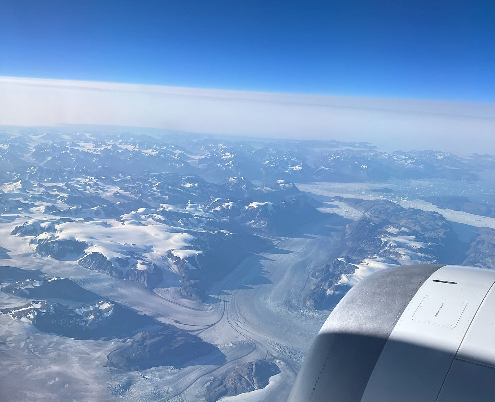
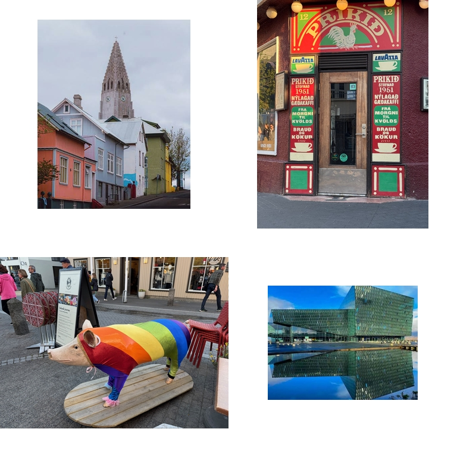
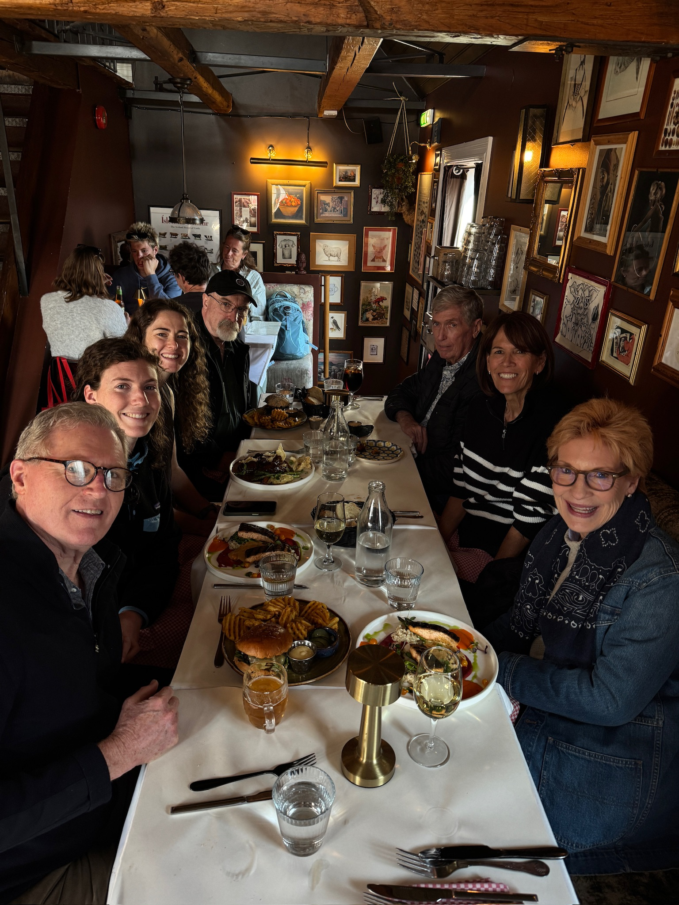
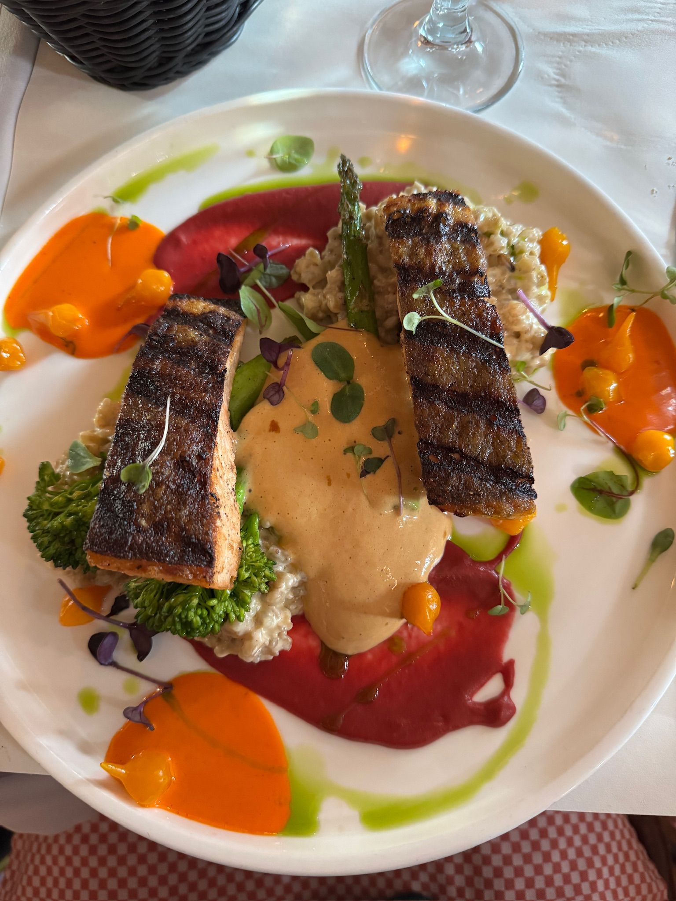
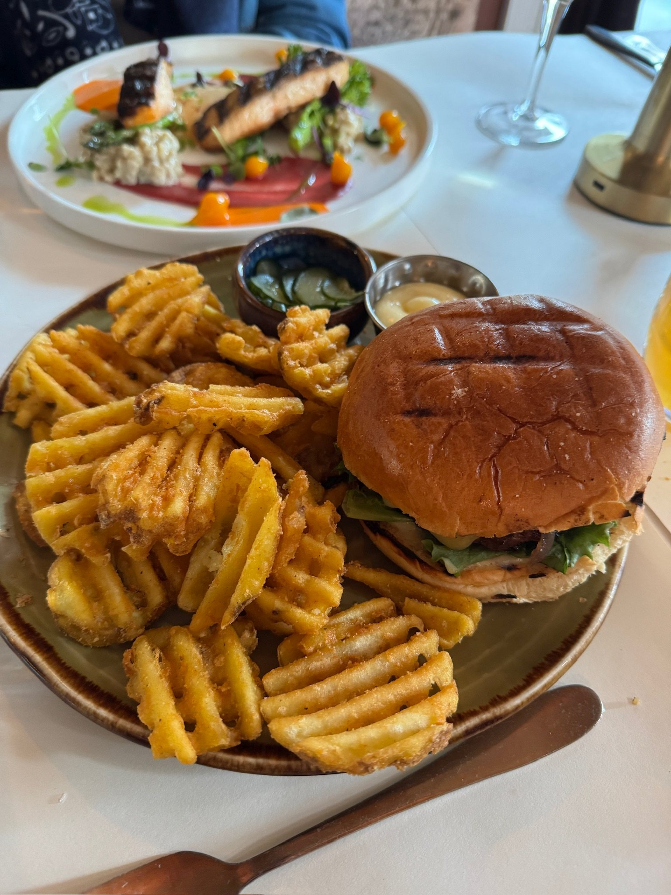
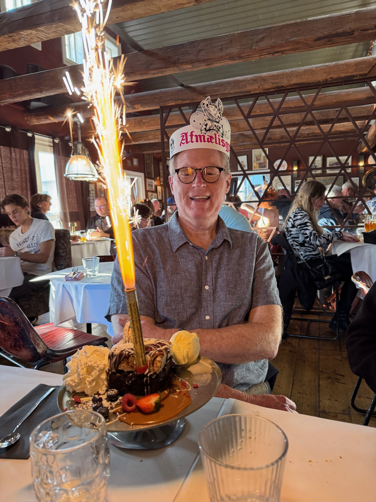
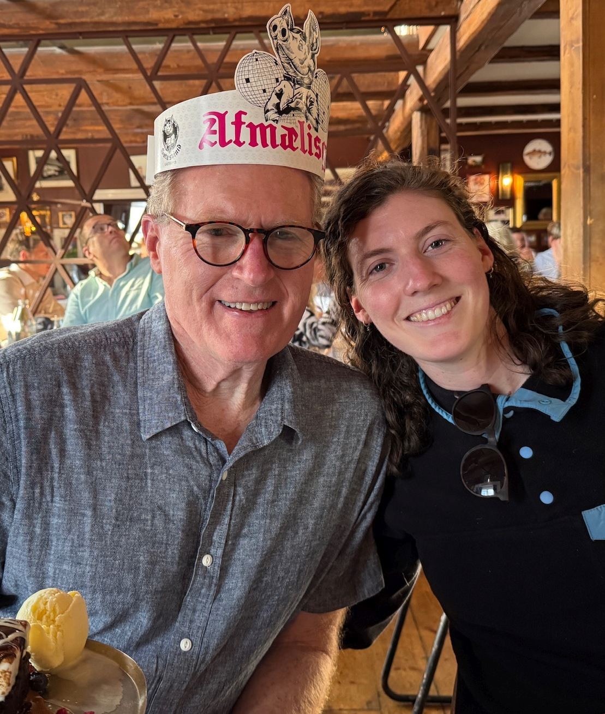

*Photo from the air taken by Bill MacIver*
We arrived in Reykjavik yesterday morning at about 9:30 am local time. We deplaned old school style, exiting our Alaska Airlines flight down a stairway onto the airport tarmac. The air was cool and crisp, with a gentle breeze, which felt like heaven after spending eight hours cooped up in that flying aluminum tube. Buses were waiting to ferry us to the terminal.  There was a long line to get through Icelandic immigration. Upon arriving at the front of the line, we were met with a rather dour, surprisingly young immigration officer who wanted to know how long we planned to stay in Iceland and what we were planning to do in her country. She could find no fault with our answers and waved us through.  Soon after being turned loose we found our luggage and got on a bus headed for Reykjavik.  The airport is quite a ways out of town and it took us quite a while to finally get into town.  We got a chance to see some of the volcanic countryside in our way into town. Think of the surface of the moon with some sparse ground cover sprouting up here and there. No trees at all.  You can tell this was not an easy land to settle.  

Arriving in town we had to change to a local bus which took us within a few blocks of our hotel. (Note to self: Next time, arrange for ground transport in advance.)  We wheeled our bags along the sidewalk and took in the charming city of Reykjavik. It is neat as a pin. A mix of older, well preserved buildings of then with colorfully painted corrugated metal siding, sitting next to sleek, modern buildings, many with a Brutalist-flavored simplicity.  Altogether charming and fascinating.  Many of the older buildings are painted in happy colors like red, blue and yellow. We saw the steeple of the massive church rising above everything.  We saw the gorgeous glass covered Harpa opera house which lies close to the water. It was a great introduction to the city, although we were a bit exhausted from flying all night and were ready for a rest.  

Unfortunately, our room wasn't ready yet so we went out for a walk around town.  There is a long pedestrian walking street called the Laugavegur which we traversed, stopping here and there to see the shops selling souvenirs, clothing and typical Icelandic baked goods.  

We did get a chance to sample a cinnamon roll but didn't think they were at their best in the afternoon. Then back to the hotel for a rest before dinner.

Cath's brother Bill is with us on the trip, and we had arranged with him to come buy our room before we went to dinner. I heard a knock on the door and answered it, saying to myself this must be Bill. Opening the door, who did I see but our daughter Jane and her good friend Heather David! It was one of the biggest and best surprises I can ever remember having. I guess is should tell you that August 1 is my birthday and it is my 70th, kind of a ~~millstone~~ millstone.  Cath and Jane cooked up this surprise a few weeks ago when Jane decided to join Heather on a trip that Heather  had been planning for a few months.

After I picked myself up off the floor we all walked to the Sæta Svínið Gastropub where we had a really delicious birthday dinner for yours truly.  Here are a few photos of the event.  

*From left: Jim, Jane, Heather, Bill, Don, Gail, and Cath*

*Salmon at Sæta Svínið*

 

Although they offered such Icelandic specialties as lamb rump, pork cheeks, and horse carpachio, I opted for the hamburger, and it was just right.  Good thing I saved some room for dessert because they brought me a huge ice cream and chocolate dessert accompanied by a burning flare. Wow! I'm so grateful to my lovely spouse Cath for planning such a memorable 70th birthday party for me.  

We left the restaurant close to 10:00 p.m. and it wasn't even close to dark. Just approaching dusk.  It was a bit chilly but still sweater weather.  We strolled down the walking street back towards our hotel, talking about what a great town Reykjavik is and how much we enjoyed our first day here.  

Here's one of me and the surprise guest:

*Me wih the surprise guest.*
