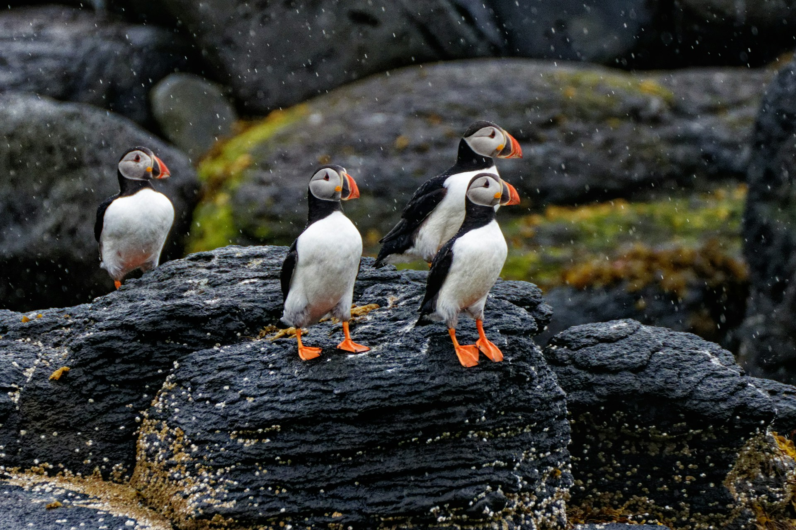

Hello again, dear readers! Fresh off the heels of our trip to Spain earlier this year, we’re off again, this time headed north. We’ll fly from Seattle to Reykjavik, board the Viking Cruise Line ship Mars, and take a eight day cruise all the way round the frosty island nation of Iceland. We’re excited to have a chance to discover this unique, historic and beautiful country. We hope to see lots of natural beauty (including some of the most majestic waterfalls anywhere), eat some of the local fare (the fermented shark called *kæstur hákarl* that smells like ammonia is a must-try specialty), and get to know a bit more about Icelandic culture.

Some of you may recall that in May of 2024 we took a cruise from Montreal up the St. Lawrence River Estuary, exploring several of the islands north of Quebec, and then down through Maine to Boston. I didn’t dust off my travel blog for that trip (it was kind of spur of the moment). That trip was with all three of my siblings and their spouses. We had such a nice time on that trip that we decided we should do another, so this is it. Come along with us and let’s see what Iceland has to offer!

*Icelandic Puffins*
